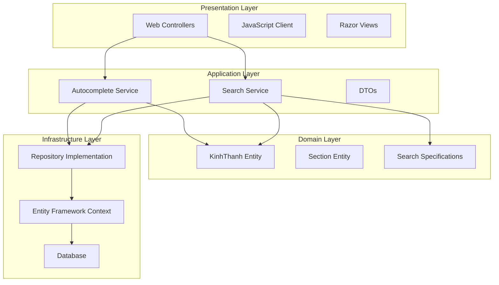

# Design Document

## Overview

The search autocomplete feature will be implemented as a modern ASP.NET Core 9 web application following Clean Architecture principles. The system provides real-time search suggestions with debouncing, comprehensive search functionality with filtering and pagination capabilities, and responsive design for cross-device compatibility. The architecture separates concerns across distinct layers while maintaining loose coupling through dependency injection.

The solution consists of a responsive web interface with JavaScript-powered autocomplete functionality that triggers after 2+ characters, backed by efficient API endpoints that query a database containing KinhThanh records and their associated Section references. The system includes comprehensive error handling, structured logging, retry logic, and maintains user sessions during failures. Data storage is abstracted through repository interfaces to support multiple data sources like SQL Server, SQLite, Excel, and others for easy switching between implementations.

## Architecture

The application follows Clean Architecture with four distinct layers:



### Layer Responsibilities

- **Presentation Layer**: Handles HTTP requests, user interface rendering, and client-side interactions
- **Application Layer**: Orchestrates business operations, implements use cases, and manages data transfer
- **Domain Layer**: Contains business entities, domain logic, and specifications
- **Infrastructure Layer**: Manages data persistence, external services, and cross-cutting concerns

## Components and Interfaces

### Domain Models

```csharp
public class KinhThanh
{
    public int Id { get; set; }
    public string Content { get; set; }
    public int SectionId { get; set; }
    public string From { get; set; }
    public string To { get; set; }
    public string Type { get; set; }
    public string Author { get; set; }
}

public class Section
{
    public int Id { get; set; }
    public string Name { get; set; }
    public string Description { get; set; }
    public ICollection<KinhThanh> KinhThanhs { get; set; }
}
```

### Repository Interfaces

```csharp
public interface IKinhThanhRepository
{
    Task<IEnumerable<KinhThanh>> SearchAsync(string searchTerm, SearchFilters filters, int page, int pageSize);
    Task<IEnumerable<string>> GetAutocompleteSuggestionsAsync(string searchTerm, SearchFilters filters, int maxResults);
    Task<int> GetSearchCountAsync(string searchTerm, SearchFilters filters);
}

public interface ISectionRepository
{
    Task<IEnumerable<Section>> GetAllAsync();
    Task<Section> GetByIdAsync(int id);
}
```

### Application Services

```csharp
public interface ISearchService
{
    Task<SearchResultDto> SearchAsync(SearchRequestDto request);
    Task<int> GetSearchCountAsync(SearchRequestDto request);
}

public interface IAutocompleteService
{
    Task<IEnumerable<string>> GetSuggestionsAsync(AutocompleteRequestDto request);
}
```

### API Controllers

- **SearchController**: Handles search operations and pagination
- **AutocompleteController**: Provides real-time suggestions with debouncing support

### Client-Side Components

- **SearchInterface**: Main search form with textbox, filters, and search button
- **AutocompleteHandler**: Manages suggestion dropdown, debouncing (300ms), request cancellation, and user interactions
- **ResultsDisplay**: Renders search results with pagination controls and loading indicators
- **FilterManager**: Handles filter checkbox states and real-time filter updates
- **ValidationHandler**: Manages client-side validation and user-friendly error messages
- **LoadingIndicator**: Shows progress during search operations and API calls

### User Interface Design

#### Search Interface Layout
- **Search Textbox**: Primary input field with minimum 2-character trigger for autocomplete
- **Search Button**: Executes search with loading state indicator during operations
- **Filter Checkboxes**: Grouped by Type, Author, and Section for easy selection
- **Active Filter Display**: Shows currently applied filters with clear indicators

#### Autocomplete Dropdown
- **Suggestion List**: Maximum 10 suggestions displayed below textbox
- **Keyboard Navigation**: Arrow keys for navigation, Enter to select, Escape to close
- **No Results Message**: "No suggestions found" when no matches exist
- **Click Selection**: Mouse click populates textbox with selected suggestion

#### Responsive Design Considerations
- **Mobile-First Approach**: Touch-friendly controls with adequate spacing
- **Breakpoint Strategy**: Optimized layouts for mobile, tablet, and desktop
- **Filter Collapse**: Collapsible filter section on smaller screens
- **Touch Targets**: Minimum 44px touch targets for mobile usability

## Data Models

### DTOs (Data Transfer Objects)

```csharp
public class SearchRequestDto
{
    public string SearchTerm { get; set; }
    public SearchFilters Filters { get; set; }
    public int Page { get; set; } = 1;
    public int PageSize { get; set; } = 10;
}

public class SearchResultDto
{
    public IEnumerable<KinhThanhDto> Results { get; set; }
    public int TotalCount { get; set; }
    public int CurrentPage { get; set; }
    public int TotalPages { get; set; }
}

public class AutocompleteRequestDto
{
    public string SearchTerm { get; set; }
    public SearchFilters Filters { get; set; }
    public int MaxResults { get; set; } = 10;
}

public class SearchFilters
{
    public List<string> Types { get; set; } = new();
    public List<string> Authors { get; set; } = new();
    public List<int> SectionIds { get; set; } = new();
}
```

### Database Schema

```sql
-- Sections table
CREATE TABLE Sections (
    Id INT PRIMARY KEY IDENTITY(1,1),
    Name NVARCHAR(255) NOT NULL,
    Description NVARCHAR(MAX)
);

-- KinhThanhs table
CREATE TABLE KinhThanhs (
    Id INT PRIMARY KEY IDENTITY(1,1),
    Content NVARCHAR(MAX) NOT NULL,
    SectionId INT NOT NULL,
    [From] NVARCHAR(255),
    [To] NVARCHAR(255),
    Type NVARCHAR(100),
    Author NVARCHAR(255),
    FOREIGN KEY (SectionId) REFERENCES Sections(Id)
);

-- Indexes for performance
CREATE INDEX IX_KinhThanhs_Content ON KinhThanhs(Content);
CREATE INDEX IX_KinhThanhs_Type ON KinhThanhs(Type);
CREATE INDEX IX_KinhThanhs_Author ON KinhThanhs(Author);
CREATE INDEX IX_KinhThanhs_SectionId ON KinhThanhs(SectionId);
```

## Error Handling

### Exception Handling Strategy

- **Global Exception Middleware**: Catches unhandled exceptions and returns appropriate HTTP responses
- **Service Layer Exceptions**: Custom exceptions for business logic violations
- **Repository Layer Exceptions**: Database-specific error handling with retry logic
- **Client-Side Error Handling**: JavaScript error boundaries for UI failures

### Error Types

```csharp
public class SearchException : Exception
{
    public SearchException(string message) : base(message) { }
    public SearchException(string message, Exception innerException) : base(message, innerException) { }
}

public class AutocompleteException : Exception
{
    public AutocompleteException(string message) : base(message) { }
}
```

### Logging Strategy

- **Structured Logging**: Using Serilog with structured data
- **Log Levels**: DEBUG for development, INFO for operations, WARN for recoverable issues, ERROR for exceptions
- **Performance Logging**: Track search response times and autocomplete latency
- **Search Analytics**: Log search terms and filter usage for insights

## Testing Strategy

### Unit Testing

- **Domain Layer**: Test entity validation and business logic
- **Application Layer**: Test service orchestration and data transformation
- **Repository Layer**: Test data access logic with in-memory database
- **Controller Layer**: Test HTTP request/response handling

### Integration Testing

- **API Endpoints**: Test complete request/response cycles
- **Database Integration**: Test with real database using test containers
- **Search Functionality**: End-to-end search scenarios with various filters

### Performance Testing

- **Autocomplete Response Time**: Ensure sub-200ms response times
- **Search Performance**: Test with large datasets and complex filters
- **Concurrent Users**: Load testing for multiple simultaneous searches

### Test Coverage Goals

- **Minimum 80% code coverage** for search-related components
- **100% coverage** for critical business logic in Domain layer
- **Integration tests** for all public API endpoints
- **Performance benchmarks** for search and autocomplete operations

### Testing Tools

- **NUnit**: Primary testing framework
- **Moq**: Mocking framework for dependencies
- **FluentAssertions**: Readable test assertions
- **TestContainers**: Database integration testing
- **NBomber**: Performance and load testing